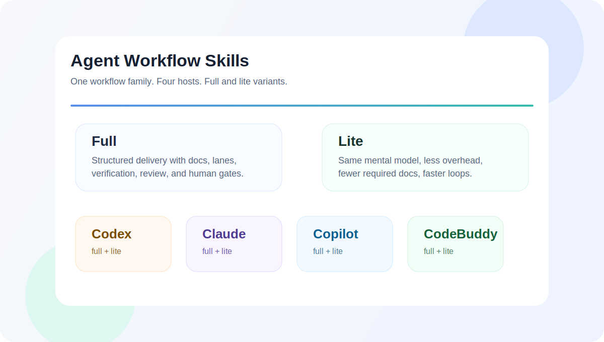

<p align="right"><a href="./README.md">EN</a> | <strong>简体中文</strong></p>

# Agent Workflow Skill Generator

<p align="center">
  
</p>

一个交互式生成器，为 AI coding agent 构建项目工作流 skill。
运行一个脚本，选择宿主和语言，就能得到即装即用的 skill 文件。

## 支持宿主

| 宿主 | Full | Lite |
|------|------|------|
| GitHub Copilot | ✓ | ✓ |
| Claude Code | ✓ | ✓ |
| Codex | ✓ | ✓ |
| CodeBuddy | ✓ (中文) | ✓ (中文) |

- **full** — 带仓库文档、任务卡、车道和人工关卡的完整流程
- **lite** — 相同交付心智模型，默认流程更轻

## 快速开始

```bash
./generate.sh
```

脚本会引导你完成四个步骤：语言、宿主、生成模式、安装目标。

常见安装目录：

- Codex：`~/.codex/skills/`
- Claude Code：`~/.claude/skills/`
- GitHub Copilot：`~/.copilot/skills/` 或仓库内 `.github/skills/`
- CodeBuddy：`~/.codebuddy/skills/`
